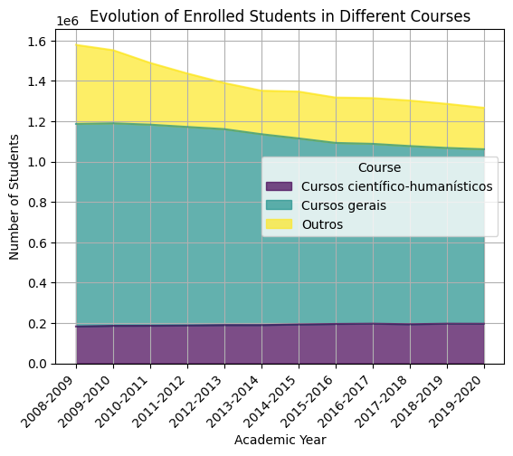

# Basic & Secondary Education in Portugal - BI, BA & BE

## Questions & Answers

### BI Questions:

> **Q** 1. What are the outcomes in the public sector versus the private sector?

> We count how many students fall into different outcome categories (like 'abandon,' 'retained,' or 'progressed') within each sector (public and private). This gives us a clear picture of the distribution of outcomes for students in both types of schools.

|                        | Abandona (Abandon) | Retido (Retained) | Transita (Progressed) |
|------------------------|---------------------|-------------------|------------------------|
| Privado (Private) Sector| 992 students        | 652 students      | 1004 students          |
| Público (Public) Sector | 1125 students       | 998 students      | 1100 students          |
**Key Observations:**
- Private sector excels in progression.
- Public sector shows commendable progression and retention, but a slightly higher abandonment rate.
---
> **Q** 2. What is the success percentage in different NUTS II regions?

> We start by grouping the data by NUTS II region and Outcome to analyze the success percentage. Then Calculate the success percentage by dividing the count of each outcome by the total count for each NUTS II region.

| NUTS II      | Outcome          | Success Percentage |
|--------------|-------------------|--------------------|
| A.M. Lisboa  | Abandona (Abandon)| 34.88%             |
| A.M. Lisboa  | Retido (Retained) | 29.85%             |
| A.M. Lisboa  | Transita (Progressed)| 35.27%          |
| Alentejo     | Abandona (Abandon)| 35.40%             |
| Alentejo     | Retido (Retained) | 28.44%             |
| Alentejo     | Transita (Progressed)| 36.16%          |
| Algarve      | Abandona (Abandon)| 39.47%             |
| Algarve      | Retido (Retained) | 23.05%             |
| Algarve      | Transita (Progressed)| 37.49%          |
| Centro       | Abandona (Abandon)| 36.45%             |
| Centro       | Retido (Retained) | 29.54%             |
| Centro       | Transita (Progressed)| 34.01%          |
| Norte        | Abandona (Abandon)| 34.73%             |
| Norte        | Retido (Retained) | 28.70%             |
| Norte        | Transita (Progressed)| 36.56%          |

**Key Observations:**
- Abandonment percentages vary across regions, with Algarve having the highest.
- Retention rates are relatively consistent across regions.
- Regions differ in the percentage of students progressing, with Algarve and Norte showing distinct patterns.
---
> **Q** 3. How has the number of students enrolled in general courses (B) and scientific-humanistic courses (S) evolved compared to other courses?

> We start by filtering the data to include only General courses (B), Scientific-humanistic courses (S), and others. Then grouping the filtered data by academic year and course, calculating the sum of enrolled students. Finally Use a stacked bar plot to visualize the evolution of enrolled students in different courses over academic years.

| academic_year | Cursos científico-humanísticos | Cursos gerais | Outros |
|---------------|--------------------------------|---------------|--------|
| 2008-2009      | 182566                         | 1003862       | 391891 |
| 2009-2010      | 185993                         | 1003646       | 362369 |
| 2010-2011      | 186345                         | 996609        | 305993 |
| 2011-2012      | 187436                         | 984167        | 265140 |
| 2012-2013      | 189619                         | 971086        | 228758 |
| 2013-2014      | 189582                         | 945935        | 215886 |
| 2014-2015      | 192689                         | 922069        | 232213 |
| 2015-2016      | 195193                         | 897235        | 224936 |
| 2016-2017      | 196555                         | 891249        | 226771 |
| 2017-2018      | 193873                         | 882935        | 225703 |
| 2018-2019      | 196520                         | 870949        | 218525 |
| 2019-2020      | 196112                         | 864784        | 205570 |

**Key Observations:**
- Scientific-humanistic courses maintain stability or slight growth.
- General courses experience a consistent decline.
- Other courses exhibit some fluctuations but generally decrease over time.
---
### BA Questions

---
### BE Questions